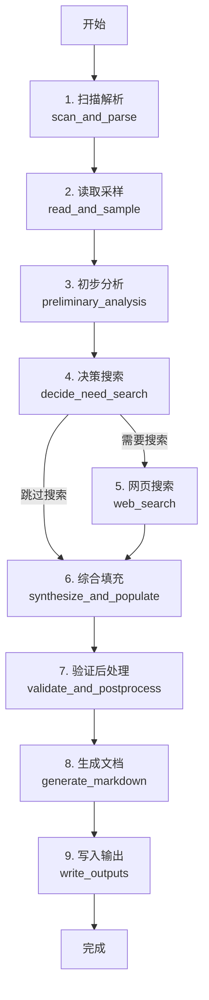

# 数据集自动标注工具 (Dataset Annotation Tool)

[](https://github.com/your-org/dsmeta)
[](LICENSE)
[](https://python.org)

> 基于大语言模型和LangGraph的智能数据集元数据自动生成工具

## 📋 项目简介

**数据集自动标注工具** 是一个专为数据科学家、算法工程师和数据管理员设计的自动化工具。它能够：

- 🔍 **智能扫描** - 自动识别和分析数据集文件夹结构
- 🧠 **AI分析** - 使用大语言模型深度理解数据集内容和特征  
- 🌐 **网页搜索** - 自动搜索获取数据集的来源、许可证和引用信息
- 📝 **多格式输出** - 生成Markdown、JSON、YAML等多种格式的元数据文档
- ⚡ **高度可配置** - 支持自定义模板、搜索提供商和处理策略

### 🎯 核心价值

- **节省时间** - 将人工数小时的元数据整理工作缩短至分钟级
- **提高质量** - 基于AI的一致性分析，避免人工标注的主观差异
- **增强发现** - 通过网页搜索自动发现数据集的官方信息和学术引用
- **标准化** - 统一的元数据格式，便于数据集管理和检索

## 🚀 快速开始

### 安装要求

- Python 3.9+
- 必需的API密钥：
  - `SILICONFLOW_API_KEY` - 用于LLM分析
  - `TAVILY_API_KEY` - 用于网页搜索（可选）

### 安装

```bash
# 克隆项目
git clone <your-repo-url>
cd 数据集标注工具

# 安装依赖
cd dsmeta
pip install -e .
```

### 配置环境变量

```bash
# 设置必需的API密钥
export SILICONFLOW_API_KEY="your_siliconflow_api_key"
export TAVILY_API_KEY="your_tavily_api_key"  # 可选，用于网页搜索
```

### 基础使用

```bash
# 初始化配置文件
dsmeta config-init --output config.yaml

# 处理单个数据集
dsmeta run /path/to/your/dataset

# 使用自定义配置
dsmeta --config config.yaml run /path/to/your/dataset

# 显示当前配置
dsmeta config-show

# 验证现有元数据
dsmeta validate /path/to/your/dataset

# V1.2新功能: 目录监控 🔍
# 监控单个目录
dsmeta watch -d /path/to/datasets

# 监控多个目录，自定义匹配模式
dsmeta watch -d /data/datasets -d /backup/data -p "**/qiaoyu-*" -p "**/dataset-*"

# 设置并发处理数量
dsmeta watch -d /path/to/datasets --max-concurrent 8
```

### 🔍 监控模式详解

监控模式是V1.2的核心新功能，能够：

- **实时监控** - 使用`watchdog`监控文件系统变化
- **模式匹配** - 支持glob模式，如`**/qiaoyu-*`、`**/dataset-*`
- **并发处理** - 同时处理多个数据集，提高效率
- **智能重试** - 失败任务自动重试，指数退避延迟
- **状态监控** - 实时显示处理进度和队列状态

```bash
# 监控示例输出
🔍 开始监控数据集目录
监控目录: /data/datasets
匹配模式: **/qiaoyu-*
最大并发: 4 个任务
按 Ctrl+C 停止监控

✅ 检测到新数据集: /data/datasets/qiaoyu-20250826-NewDataset
⚡ 开始处理数据集 (并发任务 1/4)
📊 任务队列: 2 待处理, 1 处理中, 0 重试中
```

## 🏗️ 工作流程架构

### V1.1 完整工作流程（9个节点）



### 核心节点功能

| 节点 | 功能描述 | 输入 | 输出 |
|------|----------|------|------|
| **scan_and_parse** | 扫描文件系统，解析路径信息 | 数据集路径 | 文件列表、创建者、日期 |
| **read_and_sample** | 智能内容采样，PII脱敏 | 文件列表 | 采样内容、文件摘要 |
| **preliminary_analysis** | LLM初步分析数据集特征 | 采样内容 | 基础元数据、置信度 |
| **decide_need_search** | 判断是否需要网页搜索 | 初步分析结果 | 搜索决策 |
| **web_search** | 网页搜索补充信息 | 数据集名称、关键词 | 搜索结果 |
| **synthesize_and_populate** | 综合分析，生成完整元数据 | 本地分析+搜索结果 | 完整元数据 |
| **validate_and_postprocess** | 数据验证和质量控制 | 完整元数据 | 验证后元数据 |
| **generate_markdown** | 生成多格式文档 | 验证后元数据 | 文档内容 |
| **write_outputs** | 写入输出文件 | 文档内容 | 输出文件 |

## 📊 元数据字段体系

### 完整的25+字段元数据

| 分类 | 字段 | 描述 | 自动化程度 |
|------|------|------|------------|
| **基础信息** | `name`, `description`, `size`, `num_files` | 数据集基本属性 | 🟢 全自动 |
| **技术属性** | `modality`, `use_case`, `file_formats` | 数据模态和用途 | 🟢 全自动 |
| **业务属性** | `domain`, `business_direction`, `rating` | 专业领域分类 | 🟡 AI推荐 |
| **来源信息** | `source`, `source_url`, `license`, `citation` | 官方来源和引用 | 🔵 搜索辅助 |
| **质量安全** | `pii_risk`, `quality_notes`, `checksum` | 质量和安全评估 | 🟢 全自动 |

## ⚙️ 配置选项

### 主要配置文件结构

```yaml
# 应用基础配置
app_name: dataset-annotation-tool
version: 1.2.0
debug: false

# 大语言模型配置
llm:
  provider: siliconflow
  model: THUDM/GLM-4-9B-0414
  api_key: ${SILICONFLOW_API_KEY}
  temperature: 0.1
  max_tokens: 4000

# 网页搜索配置 (V1.1功能)
search:
  enabled: true
  provider: tavily
  api_key: ${TAVILY_API_KEY}
  max_results: 10
  timeout: 30

# 目录监控配置 (V1.2新功能) 🔍
monitoring:
  directories:
    - "/data/datasets"
    - "/backup/datasets"
  patterns:
    - "**/qiaoyu-*"
    - "**/dataset-*"
  recursive: true
  max_concurrent_tasks: 4
  cooldown_seconds: 5
  retry_attempts: 3
  queue_size: 1000

# 文件处理配置
file_processing:
  max_file_size: 50MB
  sample_head_lines: 1000
  sample_tail_lines: 100
  sample_random_size: 500

# 输出配置
output:
  template_dir: ./templates
  output_formats: [markdown, json, yaml]
  backup_existing: true

# 质量控制配置
quality_control:
  min_confidence_score: 0.7
  enum_validation: true
  required_fields: [name, description, modality]
```

## 🔧 高级功能

### 自定义模板

创建自定义Markdown模板：

```jinja2
# {{ name }}

{{ description }}

## 📋 基本信息

- **数据集名称**: {{ name }}
- **创建者**: {{ creator }}
- **版本**: {{ version }}
- **总大小**: {{ size }}
- **文件数量**: {{ num_files }}

## 🎯 技术属性

- **数据模态**: {{ modality }}
- **主要用途**: {{ use_case }}
- **专业领域**: {{ domain }}


## 🔗 来源信息

- **官方链接**: [{{ source }}]({{ source_url }})

- **许可证**: {{ license }}




## 📚 引用信息

```
{{ citation }}
```

```

### 网页搜索配置

支持多种搜索提供商：

```python
# Tavily搜索 (推荐)
search:
  provider: tavily
  api_key: your_tavily_key

# 或使用其他提供商
search:
  provider: serper
  api_key: your_serper_key
```

### 监控模式 (V1.2计划功能)

```bash
# 监控目录变化，自动处理新数据集
dsmeta watch /data/datasets --pattern "qiaoyu-*"
```

## 📈 版本历史

### V1.2.0 (当前版本)
- 🔍 **新功能**: 目录监控服务(`dsmeta watch`) - 自动检测新增数据集
- ⚡ **新功能**: 并发处理队列 - 支持同时处理多个数据集
- 🛡️ **新功能**: 失败重试机制 - 智能错误恢复和指数退避
- 📊 **新功能**: 实时状态监控 - 任务队列和处理状态可视化
- 🎯 **增强**: 模式匹配支持 - 灵活的数据集识别规则
- ⚙️ **改进**: 配置管理增强 - 支持监控相关参数配置

### V1.1.0
- ✨ **新功能**: 集成网页搜索API，自动获取数据集来源信息
- ✨ **新功能**: 9节点完整工作流，支持条件分支
- ✨ **新功能**: 综合分析节点，融合本地分析和搜索结果
- ✨ **新功能**: 数据验证和后处理节点
- 🎨 **改进**: 全面中文化注释和文档
- 🎨 **改进**: 更智能的置信度评估和质量控制

### V1.0.0
- ✨ 引入节点级缓存与结构化日志
- ✨ Pydantic数据验证与字段规范化
- 🎨 增强内容采样与PII脱敏

### V0.1.0 (MVP)
- 🎉 基础5节点工作流
- 📝 Markdown和JSON输出支持
- 🔧 基础配置管理

## 🤝 贡献指南

我们欢迎社区贡献！请查看以下方式：

1. **报告问题** - 使用GitHub Issues报告bug或提出功能请求
2. **代码贡献** - Fork项目，提交Pull Request
3. **文档改进** - 帮助完善文档和示例
4. **模板分享** - 分享自定义的文档模板

### 开发环境搭建

```bash
# 安装开发依赖
pip install -e ".[dev]"

# 运行测试
pytest

# 代码格式化
black src/
ruff src/

# 类型检查
mypy src/
```

## 📄 许可证

本项目采用MIT许可证。详见 [LICENSE](LICENSE) 文件。

## 🙋‍♂️ 获得帮助

如果您遇到问题或需要帮助：

1. 📖 查看 [CLAUDE.md](CLAUDE.md) 了解详细的技术文档
2. 🐛 在GitHub Issues中报告问题
3. 💬 参与社区讨论
4. 📧 联系维护团队

## 🔮 路线图

### V1.2 (已完成) ✅
- 📁 目录监控和自动处理 ✅
- 🔄 并发处理和任务队列 ✅  
- 💾 检查点机制和故障恢复 ✅

### V1.3 (开发中)
- 🌐 简易Web UI界面
- 🔌 插件化文件解析器  
- 👥 人工校对工具
- 📊 处理统计和报告功能

### V1.4 (规划中)
- 🔗 RESTful API接口
- 🐳 Docker镜像发布
- ☁️ 云端部署支持
- 🔄 增量更新机制

---

<div align="center">

**让AI为您的数据集管理赋能** 🚀

[开始使用](#-快速开始) | [查看文档](CLAUDE.md) | [报告问题](https://github.com/your-org/dsmeta/issues)

</div>